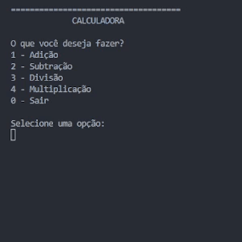

# Calculator Project 

This project is a console application calculator solution, built in C#. The purpose of this project is to practice the fundamentals of software development with C#, this being my first approach to this language. The Calculator performs 4 basic operations (addition, subtraction, multiplication, and division) through an options menu.

<p align=center></p>

## Key Concepts

This project served to apply some key programming concepts implemented with the C# programming language. Below is the list of these concepts:


>   * Flow Control (programming principles)
>       * Coalesce Structure
>       * Multiple assigment
>       * Casting type
>       * Strategy Design Pattern
>       * User I/O system
>   * Basic OOP Architecture
>       * Compound return (Named Tuple)
>       * Higher-order function (delegate)
>   * Expression Method (lambda/anonymou fuction)
>   * Docstrings


## How to Use

To test this application, runs onto Terminal (CMD):

```bash
git clone https://github.com/mbaliu-treino/101-csharp-fundamentals.git
cd ./101-csharp-fundamentals/Calculator
dotnet run
```

## Development Roadmap

The process of building the application, aiming to make it more robust, readable, and easy to maintain.

>1. Prototype creation
>2. Solution modularization: reducing redundancies
>3. Docstrings
>4. Error handling
>    * User input control (infinite loop)
>    * Validation of business rules (impossibility of division by 0)
>5. Reducing code repetition (use of higher-order function)


### Next Steps for Improvements

>6. Secure input control
>7. Logging system