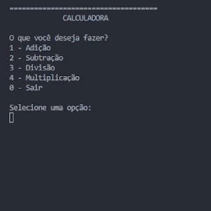

# Projeto de Calculadora

Este projeto é uma solução de calculadora no modo de aplicativo de Console, construído em C#. O objetivo deste projeto é praticar os fundamentos do desenvolvimento de software com o C#, sendo este minha primeira aproximação nesta linguagem. O calcuradora realiza 4 operações básicas (soma, subtração, multiplicação e divisão) através de um menu de opções.




## Principais conceitos

Este projeto serviu para aplicar alguns conceitos chaves da programação implementados com a linguagem de programação C#. A seguir segue a lista desses conceitos.

* Controle do fluxo de execução (princípios de programação)
    * Estrutra Coalesce
    * Atribuição múltipla
    * Conversão de tipos
    * Strategy Design Pattern
* Sistema de IO para usuários
* Arquitetura OOP básica
    * Múltiplos parâmetros (Tupla nomeada)
    * Função de alta ordem (delegate)
* Método de Expressão (função lambda/anônima)
* Docstrings


## Modo de Usar

Para usar testar este esta aplicação basta executar o arquivo `Calculator.exe` no Terminal (CMD).

```bash
git clone https://github.com/mbaliu-treino/101-csharp-fundamentals.git
cd .\101-csharp-fundamentals\Calculator
.\Calculator.exe
```


## Roadmap do Desenvolvimento

Processo de construção do aplicativo, visando torná-lo mais robusto, legível e fácil de manter.

1. Criação do protótipo
2. Modulação da solução: redução de redundâncias
3. Docstrings
4. Tratamento dos erros
    * Controle da entrada do usuário (loop eterno)
    * Validação de regras de negócios (impossibilidade de divisão por 0)
5. Redução de repetição de código (uso de função de alta ordem)


### Próximos Passos de Melhorias

6. Controle de entrada segura
7. Sistema de log